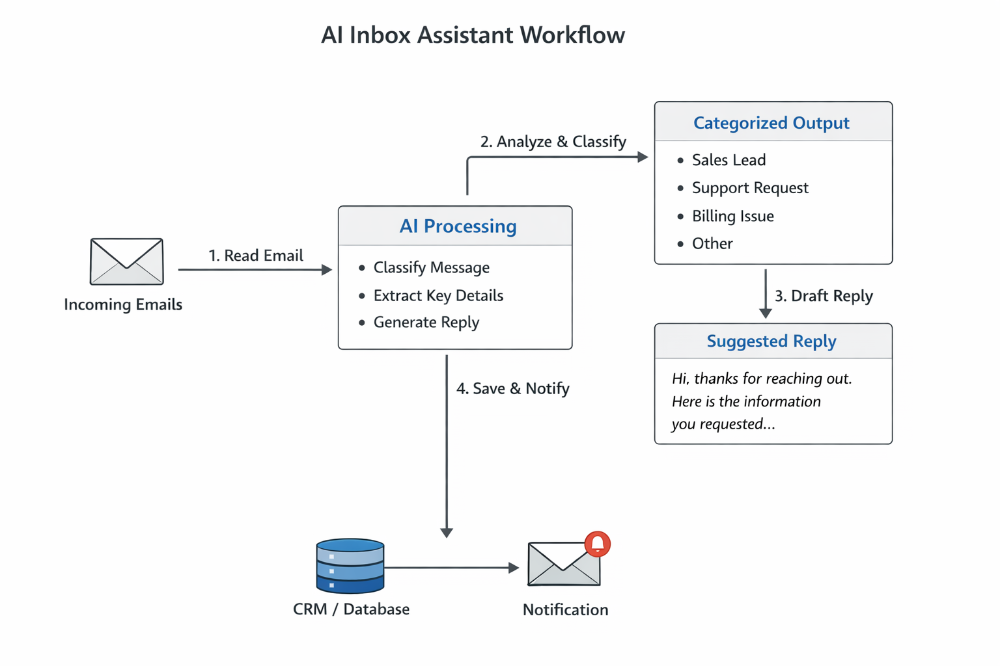

# AI Inbox Assistant

AI-powered inbox triage and reply drafting demo for small businesses.

## What it does

This project demonstrates an inbox assistant workflow that:

- reads incoming enquiries or support emails
- classifies them by type and urgency
- extracts useful details
- drafts a suggested reply
- outputs structured data for follow-up

## Why this matters

Small businesses often lose time manually sorting emails, identifying urgent messages, and drafting replies.

This demo shows how an AI-assisted workflow can reduce admin time, improve response consistency, and prepare structured data for follow-up or CRM entry.

## Example use cases

- lead qualification
- customer support triage
- booking enquiries
- admin email sorting
- internal ops inbox automation

## Example workflow

1. A new email arrives
2. The system reads the subject and body
3. AI classifies the message
4. Key details are extracted
5. A reply draft is generated
6. The result is saved for human review or next-step automation

## Workflow Diagram

This workflow reads incoming emails, classifies intent and urgency, extracts key details, drafts a suggested reply, and saves the result for review or follow-up.

## Example categories

- Sales lead
- Support request
- Billing query
- Partnership enquiry
- Spam / irrelevant
- Urgent issue

## Tech direction

This demo is designed around tools such as:

- n8n
- AI models (for classification and drafting)
- Gmail / email provider integrations
- Google Sheets / database / CRM outputs
- lightweight dashboard or review layer

## Files in this repo

- `docs/overview.md` — more detailed walkthrough
- `sample-data/` — sample inputs and outputs
- `prompts/` — example prompt logic
- `assets/` — diagrams and visuals

## Project Files

- [Workflow overview](docs/overview.md)
- [Sample inbox emails](sample-data/example-inbox-emails.json)
- [Sample structured output](sample-data/example-output.json)
- [Triage prompt](prompts/triage-prompt.md)

## Notes

This is a public showcase project intended to demonstrate workflow design and implementation capability.
No real client data, private credentials, or confidential business logic are included.

## Contact

Built by Ndala  
For freelance or consulting work: `ndalabuilds@esinya.com`
